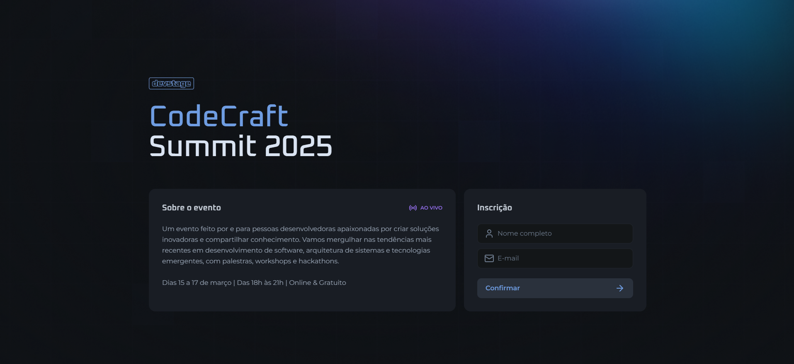
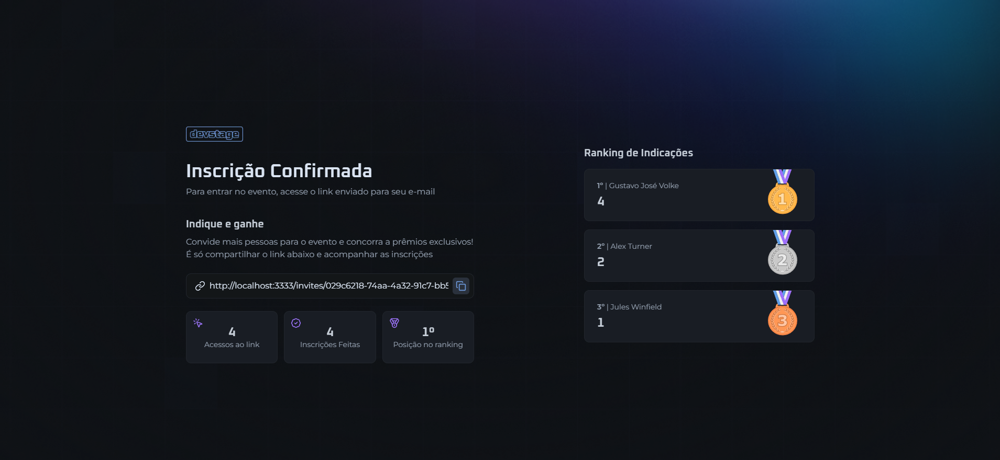

<h1 align="center">Devstage</h1>

<p align="center">
  <a href="#tecnologias">Tecnologias</a>&nbsp;&nbsp;&nbsp;|&nbsp;&nbsp;&nbsp;
  <a href="#projeto">Projeto</a>&nbsp;&nbsp;&nbsp;|&nbsp;&nbsp;&nbsp;
  <a href="#executar">Como Executar</a>&nbsp;&nbsp;&nbsp;|&nbsp;&nbsp;&nbsp;
  <a href="#imagens">Imagens</a>&nbsp;&nbsp;&nbsp;
</p>

<br>

# Tecnologias

Esse projeto foi desenvolvido com as seguintes tecnologias:

- React JS
- Typescript
- Tailwind
- Next
- Git e Github

# Projeto

O site Devstage foi feito para funcionar como um sistema de indicação de usuários. Um usuário pode gerar um link e enviar para outra pessoa e caso essa pessoa se cadastre por esse link, fica registrada uma indicação para o usuário, de modo que existe um sistema de ranking de indicações e pontuação. Projeto idealizado e desenvolvido junto com a Rocketseat na NLW Connect.

# Executar

- Primeiramente a API deve estar executando. Para isso é importante ter o docker instalado e rodando na máquina. Após isso, executar dentro da pasta api os seguintes comandos:

```bash
  # Instalar as dependências:
  $ npm install

  # Subir os containers do Docker:
  $ docker compose up -d

  # Iniciar a api:
  $ npm run dev
```

- Com a API executando, dentro da pasta web executar os seguintes comandos:

```bash
  # Instalar as dependências:
  $ npm install

  # Iniciar o frontend:
  $ npm run dev
```

# Imagens

<div style="display: flex; flex-direction: column; align-items: center;">  
  
    
</div>
